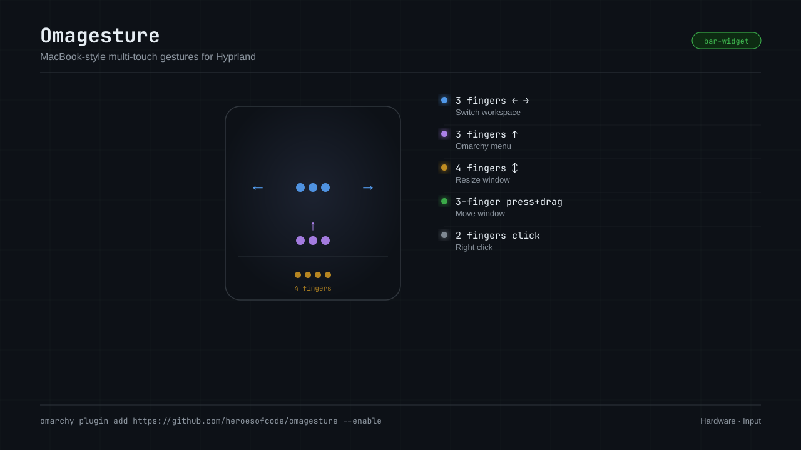

# Omagesture

MacBook-style multi-touch gestures for Hyprland, configured from the Omarchy bar.

Three fingers slide between workspaces, and the workspace follows your fingers
in real time rather than jumping at the end of the swipe — that part is
Hyprland's native `workspace` gesture action, not a script pretending.



## Install

```bash
omarchy plugin add https://github.com/heroesofcode/omagesture --enable
```

Needs Omarchy 4 (for the bar plugin API) and a multi-touch trackpad. It was
built and tested on a MacBook's internal trackpad under Hyprland; the gesture
mapping is generic, but see the notes at the bottom for what varies by
hardware.

The scripts shell out to `hyprctl`, `jq`, `awk`, `sed` and `grep`, and
`omagesture-diagnose` additionally uses `libinput`. All of these already ship
with Omarchy, so there is nothing extra to install.

## Defaults

| Gesture | Action |
|---|---|
| Three fingers ← → | Switch workspace (continuous) |
| Three fingers ↑ | Omarchy menu |
| Four fingers ← → ↑ ↓ | Resize the focused window (continuous) |
| Three-finger click, hold and drag | Move the window (swaps with whatever is under the cursor) |

Also sets: natural scrolling on, two-finger right click (`clickfinger`),
multi-finger drag off.

Every slot is remappable to: nothing, switch workspace, scratchpad, fullscreen,
maximize, float/tile, move window, resize window, close window, zoom screen, or
the Omarchy menu.

## Using it

Click the 󰠡 icon in the bar. Right-clicking the icon toggles all gestures off
and on without opening the panel.

The panel edits whole axes (← → as one control) because a continuous workspace
swipe is a single gesture covering both directions. The per-direction keys are
still editable from the plugin's entry in the shell settings schema if you want
an asymmetric map.

## From a terminal

`omagesture-apply` is the only thing that writes Lua; the panel shells out to
it. Missing keys fall back to the defaults, so partial objects are fine.

```bash
./omagesture-apply '{"g3Up":"fullscreen"}'   # apply
./omagesture-apply --print                   # show the default Lua, write nothing
echo '{"enabled":false}' | ./omagesture-apply -

./omagesture-diagnose                        # name every gesture as it arrives
./omagesture-diagnose --stop                 # tally what fired, restore config
```

Note that the panel rewrites the file from its own saved settings the next time
anything changes, so terminal edits are for trying things out, not for
persisting them.

## How it reaches Hyprland

`omagesture-apply` writes `~/.config/hypr/omagesture.lua` and calls
`omagesture-require`, which appends a marked block to `~/.config/hypr/hyprland.lua`:

```lua
-- omagesture:begin (managed by io.github.heroesofcode.omagesture — do not edit)
pcall(require, "hypr.omagesture")
-- omagesture:end
```

The block goes last on purpose. Hyprland cannot unbind a gesture: the first
registration of an axis wins and later ones fail as "overshadowed". Loading
last means a hand-written gesture in `input.lua` quietly takes precedence over
ours instead of breaking the config.

## How far the workspace swipe reaches

Hyprland picks the swipe target with its `m` selector by default, which walks
only the workspaces that currently exist and wraps at the end. With workspaces
1 and 2 open you reach a third (created on the fly) and then you are stuck:
workspace 3 is empty, so there is no "last non-empty workspace" to create a
fourth past.

Omagesture defaults to **Reaches: every workspace**, which sets
`gestures:workspace_swipe_use_r`. The `r` selector targets by workspace
*number*, so the swipe keeps going to 4, 5, 6 and back down whether or not
those workspaces exist yet. Empty ones are destroyed when you leave them, so
nothing accumulates.

Set it back to **Only open ones** for Hyprland's stock behaviour. **Keep
swiping without lifting** (`workspace_swipe_forever`) lets one long motion
cross several workspaces instead of one per swipe.

## Why move is a click-drag and resize is a swipe

Moving needs aim: dragging a tiled window swaps it with whatever sits under the
cursor, so the gesture has to carry a pointer position. Resizing does not — it
is a magnitude, and a swipe expresses that fine.

So the one mechanism that moves the pointer (press the trackpad with three
fingers and drag, which `clickfinger` reports as a middle-button drag) is spent
on moving, and resizing lives on the four-finger swipe. This is the same split
as `SUPER` plus a mouse button, minus the keyboard.

Swap them from the panel: **Middle click** offers *Hold & drag to move* and
*Hold & drag to resize*.

## Two-finger click is deliberately not bound

Two fingers are right-click under `clickfinger`. Binding that to a drag would
consume it, and every context menu on the system would stop opening.

Hyprland's `binds:drag_threshold` looks like the way around it — with a
non-zero threshold a click that never moves should reach the application while
a genuine drag triggers the bind, which would let two-finger click keep its
menu *and* gain window dragging. The option exists and accepts a value, but
that pass-through behaviour was never confirmed in testing, so nothing ships
using it.

## Things that are true and not obvious

**There is no window overview.** Hyprland has no Mission Control without the
`hyprexpo` plugin, which Omarchy does not ship by default. The `Scratchpad`
action is the nearest thing on offer. If you install hyprexpo, add its
dispatcher as a new action token.

**Resize needs something to resize against.** With a single window on the
workspace the tiling has no split to move, so the gesture looks dead. Open a
second window and the swipe walks the divider between them.

**Hyprland's native `resize` gesture action did nothing when tested.** It
registers without complaint, which makes it look configured, but on the machine
this was built on a four-finger swipe bound to it left tiled windows untouched
— while
`hl.dsp.window.resize({ relative = true })`, the dispatcher behind
`SUPER` + right-drag, moved the split correctly (557px to 677px and back).
So `resize_window` emits a small Lua handler that feeds each motion delta into
that dispatcher instead of using the built-in action. Registering cleanly and
doing something are two separate things to verify.

**Two fingers are left alone on purpose.** Their swipes are scroll and their
click is right-click, so binding either costs something the whole system uses.
The two-finger slots are still in the settings schema if you want them.

**Two-finger swipes are never offered.** Those are scroll; a gesture bound
there would take scrolling away from everything.

**Pinch is an axis.** Hyprland's `pinch` direction shadows `pinchin` and
`pinchout` and is the only form that follows your fingers continuously, so the
panel maps squeeze and spread together — exactly as it does for the two swipe
axes.

**Some trackpads do not report pinch above two fingers.** Measured with
`omagesture-diagnose` on a MacBook's internal `bcm5974`: squeezing three or
four fingers arrives as a HORIZONTAL swipe, never as PINCH. That is why resize
ships on a four-finger swipe rather than the more obvious four-finger pinch —
the pinch mapping was correct and simply never fired. Your hardware may well
report it; run the diagnostic before blaming an action that appears to do
nothing.

**Multi-finger drag and swipes of the same finger count are mutually
exclusive.** libinput gives the contact to one or the other. Asking for both
drops the drag, and both the panel and the generated file say so rather than
leaving you with a setting that silently did nothing.

**`omarchy-control-panel` also writes gestures.** Its "3-finger swipe" toggle
generates `~/.config/hypr/gestures-generated.lua`, a different file from ours.
If you have that plugin enabled, turn its gesture toggle off, or both will
claim the three-finger axis and the second one to load will error.

## Uninstall

```bash
omarchy plugin disable io.github.heroesofcode.omagesture
~/.config/omarchy/plugins/io.github.heroesofcode.omagesture/omagesture-require --remove
rm ~/.config/hypr/omagesture.lua
hyprctl reload
```
